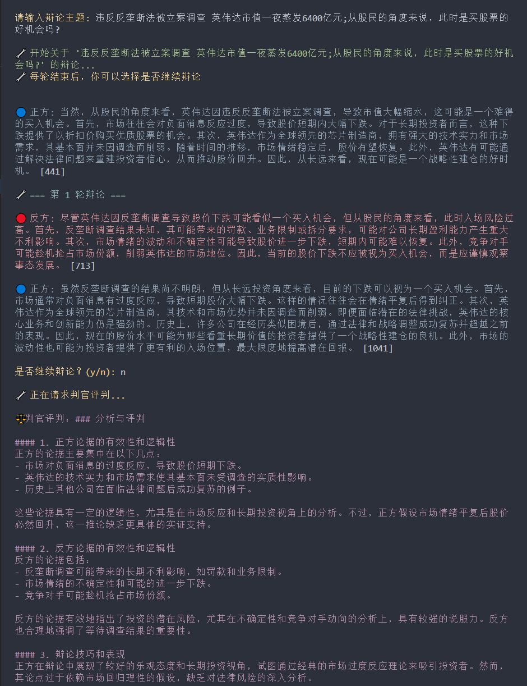

<h1 align="center"> AI-Drama </h1>
<p align="center">专属于你的赛博斗蛐蛐</p>



## 功能特点

- 支持任意主题的辩论
- 支持为正方、反方和判官配置不同的API和模型
- 正方支持并捍卫主题观点
- 反方提出质疑和反对意见
- 双方对话简短有力
- 每轮辩论后用户可选择是否继续
- 辩论结束时由判官进行专业评判
- 彩色输出界面，清晰直观
- 动态阅读时间，符合自然阅读节奏

## 安装要求

1. Python 3.7+
2. OpenAI API密钥（或兼容的API密钥）

## 安装步骤

1. 克隆项目到本地
2. 安装依赖：
   ```bash
   pip install -r requirements.txt
   ```
3. 创建 `.env` 文件并添加配置：
   ```
   # 正方配置
   OPENAI_API_KEY_POSITIVE=正方的API密钥
   OPENAI_API_BASE_POSITIVE=正方的API基础URL（可选）
   OPENAI_MODEL_POSITIVE=正方使用的模型（可选，默认：gpt-3.5-turbo）

   # 反方配置
   OPENAI_API_KEY_NEGATIVE=反方的API密钥
   OPENAI_API_BASE_NEGATIVE=反方的API基础URL（可选）
   OPENAI_MODEL_NEGATIVE=反方使用的模型（可选，默认：gpt-3.5-turbo）

   # 判官配置
   OPENAI_API_KEY_JUDGE=判官的API密钥（可选，默认使用正方的密钥）
   OPENAI_API_BASE_JUDGE=判官的API基础URL（可选）
   OPENAI_MODEL_JUDGE=判官使用的模型（可选，默认：gpt-3.5-turbo）
   ```

## 使用方法

1. 运行程序：
   ```bash
   python main.py
   ```
2. 输入你想要辩论的主题
3. 观看AI之间的正反方辩论
4. 每轮辩论结束后，输入：
   - `y`: 继续下一轮辩论
   - `n`: 结束辩论并获取判官评判
5. 随时可以按 Ctrl+C 强制终止辩论

## ⚠️ 免责声明

请注意，本项目中AI模型生成的所有内容仅供参考和娱乐目的使用。在使用本系统时，请谨记：

1. **观点中立性**：AI模型生成的观点不代表开发者或任何个人、组织的立场。

2. **内容准确性**：尽管我们努力确保系统的可靠性，但AI生成的内容可能存在事实错误或偏差。

3. **判断结果**：判官AI的评判结果仅供参考，不应被视为权威判定。

4. **使用建议**：
   - 对AI生成的内容保持理性和批判性思维
   - 不要盲目接受或传播AI生成的观点
   - 在涉及专业领域时，建议咨询相关专家

5. **责任限制**：开发者不对使用本系统产生的任何直接或间接后果承担责任。

## 许可证

本项目采用 MIT 许可证。详见 [LICENSE](LICENSE) 文件。